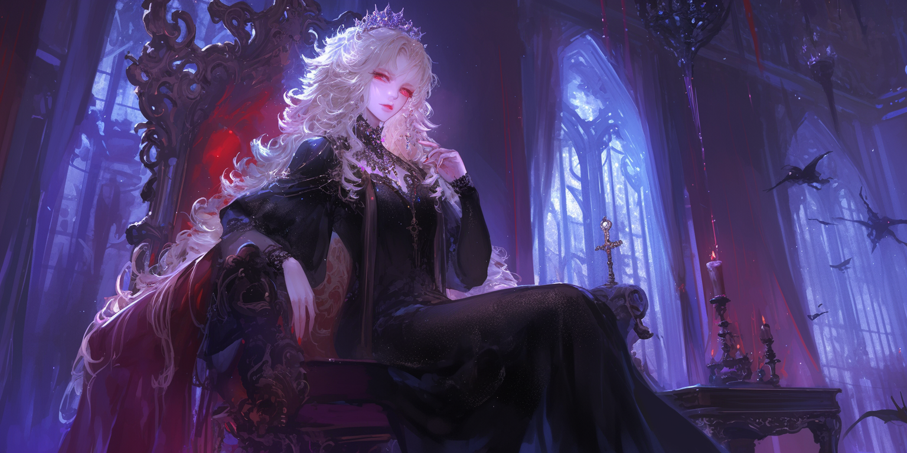

<body>

<h1>🧛‍♀️Welcome to the Family – Project 3 of The Code Fool's Journey</h1>

<h2>Overview</h2>

<h3>Situation</h3>

In a world of notifications, colorful screens, and constant stimulation of our dopamine, I feel nostalgic for a simpler time that I didn't live in, the time when computer games didn't have images and colors, when adventures were narrated by lines of text, and magic happened in the imagination. I think we need to learn to imagine again, to learn to find pleasure without the need for expensive games or over-stimulating apps.

<h3>Task</h3>

The challenge of my third project in this series was to create an engaging text-based adventure game that tracks player stats (like health and points) and allows them to shape their character’s fate through a series of questions. The game simulates a "vampire adoption" by the beautiful Lady Carmilla, with the player making decisions that affect their rank, abilities, and eventual transformation as Lady Carmilla introduces you to her dark aristocratic family, asking you to prove your worth.

<h3>Action</h3>

I built the game with multiple branching paths where decisions directly influence the outcome. Through user input, players answer questions about their habits and preferences (like sleep, exercise, and reading) to determine their health, vampire rank, and eventual type of vampire. The game uses conditional statements to handle user input and create a rich, dynamic experience.

<h3>Result</h3>

This project is focused on interactive storytelling and decision-making, while reinforcing concepts like conditionals, input handling, and tracking stats. The game’s outcome is based on player choices, making it a fun example of how logic and narrative can intertwine. I really like this style of game, and my imagination started to make me expand it much more, but the project should be simple and didactic, without using more advanced resources like loops and functions. I like how limitations can better channel creativity, forcing us to think outside the box, but I intend to remake this game or a similar one in the future, applying more advanced techniques.

<h2>Multi-Language Learning Philosophy</h2>

Just like the first project, this one is being developed in Python, JavaScript, and C++. I’m studying these three languages simultaneously to avoid becoming too attached to the quirks of just one. This method helps me grasp the core logic of programming — which is universal across languages — rather than memorizing syntax. By rewriting the same project in multiple languages, I reinforce my understanding of structures, variables, functions, and flow — while also appreciating the expressive power of each language.

<h2>Project Scope: Welcome to the Family</h2>

Core concepts covered (in addition to those already seen in the previous project and returning in this one):

<ul>
  <li>Conditional statements</li>
  <li>Interactive storytelling and branching logic</li>
</ul>

<h1>About the Code Fool's Journey</h1>

The Fool's Journey is similar to Joseph Campbell’s famous Hero’s Journey, but instead of 12 stages, it follows 22 stages, based on the 22 Major Arcana of the Tarot. Each card represents an archetype in the evolution of the protagonist, the Fool, who embarks on a path toward knowledge and personal power, just like programmers and artists. Here, each project increases in complexity and covered concepts, from simple variables and data types to APIs, Memory Management, Databases and GUI.

<h1>Feel Free to Fork the Journey</h1>

If you find this helpful for learning or teaching, you're welcome to fork, improve, or remix it in your own way. The Fool’s path is yours to walk — and code — however you like.😊

</body>

